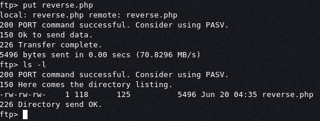

# Inclusiveness

## Recon

- **Nmap**

    Start by find the open and run service on the machine

    ```bash
    nmap 192.168.145.14 -sS -p- -T3 -Pn                       

    Starting Nmap 7.80 ( https://nmap.org ) at 2021-06-20 00:32 WIB
    Nmap scan report for 192.168.145.14
    Host is up (0.26s latency).
    Not shown: 65532 closed ports
    PORT   STATE SERVICE
    21/tcp open  ftp
    22/tcp open  ssh
    80/tcp open  http

    Nmap scan report for 192.168.145.14
    Host is up (0.26s latency).

    ```

- **FTP**

    test if we can login as anonymous, and find the `pub` directory then try to upload file if the directory is writetable

    

    Upload success, this directory is writetable

- **HTTP**

    with Gobuster, we find interesting file : `robots.txt`

    

    When try to open the file, we must change our `user-agent`

    

    With burpsuite repeater, change the user-agent with google user-agent `Googlebot`

    

    Find a nice article

    

    Then try to source code, we found is likely vuln with Local File Inclusion. Param `?lan` take an argument

    

    Try to change the parameter of `?lan` to `/etc/passwd`

    

    This machine is vulnerable to LFI, then we try to get the shell with accessing php reverse shell file, that has been uploaded with FTP in `pub` directory

## Exploiting

Try to get shell access with access the `php reverse shell` file that has been upload with `ftp` in `pub` directory leveragin the LFI vulnerability


And get the shell


Let's conduct enumeration for privilege escalation, don't forget to grab the user flag


We found interesting file in tom directory, the rootshell.c let's inspect it


If we execute this program as 'tom' we can **escalate** our privilege as **root**, this program determine who is executed the program by comparing the `whoami` default binary result in linux, let's try to modify the `whoami` binary by create our `whoami` custom binary in `/tmp` directory. This `whoami` should return `tom` for meet the requirement of `rootshell` program


Set the **permission** so we can run it

```bash
chmod 777 /tmp/whoami
```

Next we add `/tmp` directory to `$PATH` variable environment


Let's try to re run the rootshell again


That's it, we can leverage the misconfiguration of the rootshell program and get's the root privilege
