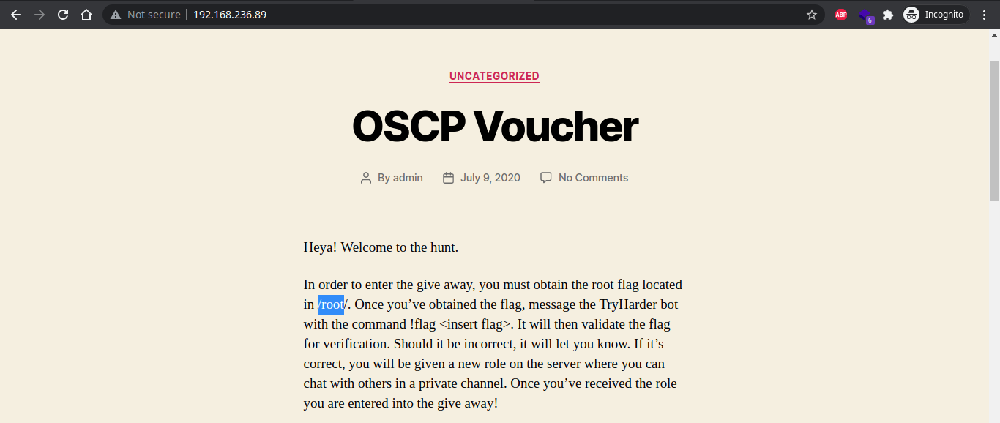

# InfosecPrep


## Recon

Start with Nmap, we try to find the running service on the machin

```bash
nmap 192.168.236.89 -Pn -T3 -sV -sC

Starting Nmap 7.91 ( https://nmap.org ) at 2021-07-25 09:37 WIB
Nmap scan report for 192.168.236.89
Host is up (0.28s latency).
Not shown: 998 closed ports
PORT   STATE SERVICE VERSION
22/tcp open  ssh     OpenSSH 8.2p1 Ubuntu 4ubuntu0.1 (Ubuntu Linux; protocol 2.0)
| ssh-hostkey: 
|   3072 91:ba:0d:d4:39:05:e3:13:55:57:8f:1b:46:90:db:e4 (RSA)
|   256 0f:35:d1:a1:31:f2:f6:aa:75:e8:17:01:e7:1e:d1:d5 (ECDSA)
|_  256 af:f1:53:ea:7b:4d:d7:fa:d8:de:0d:f2:28:fc:86:d7 (ED25519)
80/tcp open  http    Apache httpd 2.4.41 ((Ubuntu))
|_http-generator: WordPress 5.4.2
| http-robots.txt: 1 disallowed entry 
|_/secret.txt
|_http-server-header: Apache/2.4.41 (Ubuntu)
|_http-title: OSCP Voucher &#8211; Just another WordPress site
Service Info: OS: Linux; CPE: cpe:/o:linux:linux_kernel
```

Summarize, we get the following information : 

- There are two service : **ssh (22)** & **http (80)**
- **WordPress** is running on the machine with version **5.4.2**
- Find a hidden file : **robots.txt** & **secret.txt**
- **Apache** version is **2.4.41**

Open the index page, we got the root flag location which is in `/root` directory



If we open the `secret.txt` file, we got the random strings, is likely encoded in **base64**


Then try to decode the strings in [base64decode](https://www.base64decode.org/), it's reveal that the strings is a SSH Private Key this will be useful for login to a machine with SSH, we just pass the private key file and don't need a password. So save it to a file


From now, we need a candidate user available on the machine, so we can gain access with SSH

## Exploit

Trying to access SSH with **admin**,**user**, and **RRgKaep** as user give no luck, but when with **oscp**  we got the access


Listing all available file in current directory we got the first flag


## Privilege Escalation

Using [linpeas](https://github.com/carlospolop/PEASS-ng/tree/master/linPEAS) to enumerate the machine, we will find the `bash` have a permission set to root whoever who run it this is usually called **SUID** bit has set with root privilege. 

```bash
-rwsr-sr-x 1 root   root            1.2M Feb 25  2020 /usr/bin/bash
```

In [GTFOBin](https://gtfobins.github.io/gtfobins/bash/#suid) we can exploit `bash` with this command

```bash
/usr/bin/bash -p
```

After getting the **root privilege**, now we can obtain the **root flag** in the `/root` directory


