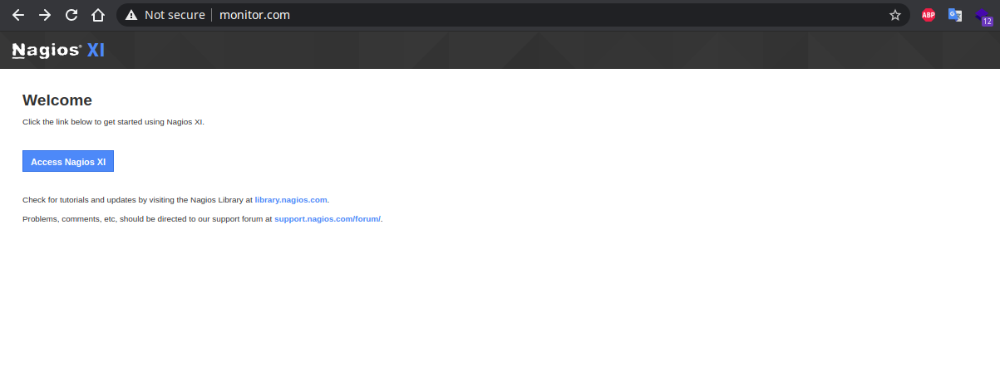

# Monitor


# Recon

Try to mapping the port and service was running on the target machine

```bash
nmap monitor.com -T3 -Pn -sV -sC

Nmap scan report for monitor.com (192.168.177.136)
Host is up (0.26s latency).
Not shown: 995 closed ports
PORT    STATE SERVICE VERSION
22/tcp  open  ssh     OpenSSH 7.2p2 Ubuntu 4ubuntu2.10 (Ubuntu Linux; protocol 2.0)
| ssh-hostkey: 
|   2048 b8:8c:40:f6:5f:2a:8b:f7:92:a8:81:4b:bb:59:6d:02 (RSA)
|   256 e7:bb:11:c1:2e:cd:39:91:68:4e:aa:01:f6:de:e6:19 (ECDSA)
|_  256 0f:8e:28:a7:b7:1d:60:bf:a6:2b:dd:a3:6d:d1:4e:a4 (ED25519)
25/tcp  open  smtp    Postfix smtpd
|_smtp-commands: ubuntu, PIPELINING, SIZE 10240000, VRFY, ETRN, STARTTLS, ENHANCEDSTATUSCODES, 8BITMIME, DSN, 
| ssl-cert: Subject: commonName=ubuntu
| Not valid before: 2020-09-08T17:59:00
|_Not valid after:  2030-09-06T17:59:00
|_ssl-date: TLS randomness does not represent time
80/tcp  open  http    Apache httpd 2.4.18 ((Ubuntu))
|_http-server-header: Apache/2.4.18 (Ubuntu)
|_http-title: Nagios XI
389/tcp open  ldap    OpenLDAP 2.2.X - 2.3.X
443/tcp open  ssl/ssl Apache httpd (SSL-only mode)
|_http-server-header: Apache/2.4.18 (Ubuntu)
|_http-title: 400 Bad Request
| ssl-cert: Subject: commonName=192.168.1.6/organizationName=Nagios Enterprises/stateOrProvinceName=Minnesota/countryName=US
| Not valid before: 2020-09-08T18:28:08
|_Not valid after:  2030-09-06T18:28:08
|_ssl-date: TLS randomness does not represent time
| tls-alpn: 
|_  http/1.1
Service Info: Host:  ubuntu; OS: Linux; CPE: cpe:/o:linux:linux_kernel

Service detection performed. Please report any incorrect results at https://nmap.org/submit/ .
Nmap done: 1 IP address (1 host up) scanned in 57.19 seconds
```

In `http-title` we found that **Nagios XI** application was running, then try to confirm this with opening the page



Try to access the application


Search in the internet for Nagios XI default credentials, we found default username is **nagiosadmin** and the password is **PASSW0RD**, try to login with that we found no lucky, the password is incorrect, try to login with password **user** no luck, then finally try to login with password **admin,** we can access the Nagios application.


From now we can conclude the application credential is **nagiosadmin:admin,** Let's try to search known exploit for Nagios XI

## Exploit

Search for known publicly exploit we found several exploit, these are available on exploit db, metasploit, or POC.


Next we search all available exploit in Metasploit


Sinced we has authenticated and know the credential is, we try to use the first exploit (`exploit/linux/http/nagios_xi_authenticated_rce`)


Adjust the **PASSWORD**, **RHOSTS**, **LHOST**, **LPORT**, and **TARGET** options and run the exploit


This exploit give us a possibility to **execute a command as root**, so from here we login and get the shell as **root**


Try to find the root flag in `/root` directory


We got the root flag, next the user flag


Just one user (`coconut`) on this machine, and no user flag, try to submit the root flag then we complete the challange, so in this machine we need just the root flag
