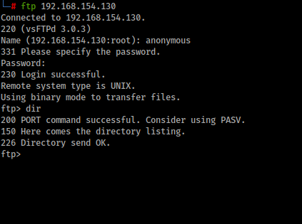

# OnSystemShellDredd


Scan available port with **Nmap**

```bash
nmap 192.168.154.130 -Pn -T3 -sV -sC -A

Nmap scan report for 192.168.154.130
Host is up (0.26s latency).
Not shown: 999 closed ports
PORT   STATE SERVICE VERSION
21/tcp open  ftp     vsftpd 3.0.3
|_ftp-anon: Anonymous FTP login allowed (FTP code 230)
| ftp-syst: 
|   STAT: 
| FTP server status:
|      Connected to ::ffff:192.168.49.154
|      Logged in as ftp
|      TYPE: ASCII
|      No session bandwidth limit
|      Session timeout in seconds is 300
|      Control connection is plain text
|      Data connections will be plain text
|      At session startup, client count was 4
|      vsFTPd 3.0.3 - secure, fast, stable
|_End of status
```

From the scan, we just got one open port `ftp` and likely allow **anonymous login** so let's try login as `anonymous` and listing available directory, we got nothing



Maybe these directory is hidden ? so try listing again but add `-a` options to list all directory included the hidden directory


We found `hannah` user directory that's contain ssh private key `id_rsa` . This **private key** will be useful for login with **SSH** as `hannah` user, so we will download that. But we don't know which port **SSH** used so let's scan again all available port (`-p-`) on target machine with **Nmap**

```bash
nmap 192.168.154.130 -Pn -T3 -sV -sC -p-

Nmap scan report for 192.168.154.130
Host is up (0.25s latency).
Not shown: 65533 closed ports
PORT      STATE SERVICE VERSION
21/tcp    open  ftp     vsftpd 3.0.3
|_ftp-anon: Anonymous FTP login allowed (FTP code 230)
| ftp-syst: 
|   STAT: 
| FTP server status:
|      Connected to ::ffff:192.168.49.154
|      Logged in as ftp
|      TYPE: ASCII
|      No session bandwidth limit
|      Session timeout in seconds is 300
|      Control connection is plain text
|      Data connections will be plain text
|      At session startup, client count was 4
|      vsFTPd 3.0.3 - secure, fast, stable
|_End of status
61000/tcp open  ssh     OpenSSH 7.9p1 Debian 10+deb10u2 (protocol 2.0)
| ssh-hostkey: 
|   2048 59:2d:21:0c:2f:af:9d:5a:7b:3e:a4:27:aa:37:89:08 (RSA)
|   256 59:26:da:44:3b:97:d2:30:b1:9b:9b:02:74:8b:87:58 (ECDSA)
|_  256 8e:ad:10:4f:e3:3e:65:28:40:cb:5b:bf:1d:24:7f:17 (ED25519)
Service Info: OSs: Unix, Linux; CPE: cpe:/o:linux:linux_kernel
```

Now we know the **SSH** port is use, so we can try to login as `hannah` . 


Listing all available files and directories we got the **user flag**

```bash
hannah@ShellDredd:~$ ls -a
.  ..  .bash_history  .bash_logout  .bashrc  local.txt  .profile  .ssh  user.txt
hannah@ShellDredd:~$
```

Next we wil use the **LinPeas** to enumerate all information about the machine to perform **escalate privilege**. Upload the **LinePeas** script from our attack machine to the target machine then run the script and save the result in a file


Next we download the result file from the target machine and see the result


The `mawk` and `cpulimit` can run under root privilege, but we can use cpulimit instead. In the [GTFOBins](https://gtfobins.github.io/gtfobins/cpulimit/#suid) we can see the command to get the root privilege


Next we grab the root flag then finish the game.


