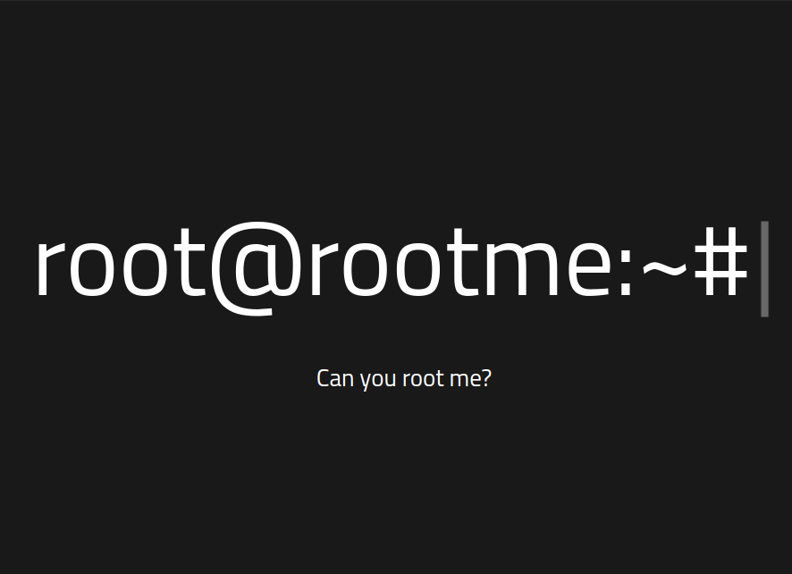

# RootMe

## Reconnaissance

- **Find Open Ports & Services**

    We will begin with nmap to find the most 30 used port, why i choose only 30 port ? because to scan all port which is 0 - 65535 take a much time, if we can't find open port on 30 of ports, then we try to scan all port

    ```bash
    nmap 10.10.135.69 -A -sV --top-ports=30  -T3
    Starting Nmap 7.80 ( https://nmap.org ) at 2021-05-19 21:51 WIB
    Nmap scan report for 10.10.197.52
    Host is up (0.20s latency).
    Not shown: 28 closed ports
    PORT   STATE SERVICE VERSION
    22/tcp open  ssh     OpenSSH 7.6p1 Ubuntu 4ubuntu0.3 (Ubuntu Linux; protocol 2.0)
    | ssh-hostkey: 
    |   2048 4a:b9:16:08:84:c2:54:48:ba:5c:fd:3f:22:5f:22:14 (RSA)
    |   256 a9:a6:86:e8:ec:96:c3:f0:03:cd:16:d5:49:73:d0:82 (ECDSA)
    |_  256 22:f6:b5:a6:54:d9:78:7c:26:03:5a:95:f3:f9:df:cd (ED25519)
    80/tcp open  http    Apache httpd 2.4.29 ((Ubuntu))
    | http-cookie-flags: 
    |   /: 
    |     PHPSESSID: 
    |_      httponly flag not set
    |_http-server-header: Apache/2.4.29 (Ubuntu)
    |_http-title: HackIT - Home
    ...
    ```

    There's two open port, one SSH and one web service (HTTP), let's try to open the ip in browser, to make sure the web service is up & running

    

    The web service is running, so we can jump to the nex step.

- **Find subdirectory**

    To find all subdirectory, we can try bruteforce with [Gobuster](https://github.com/OJ/gobuster) and default Kali Linux `common.txt` wordlist, which available on `/usr/share/wordlists/dirb/common.txt`. This wordlist contain all the top most used directory name on web service. To bruteforce it we can use the command below

    ```bash
    gobuster dir --url 10.10.135.69 -w /usr/share/wordlists/dirb/common.txt -t 10
    ```

    the `dir` argument used for specify what to bruteforce (Directory), `--url` for the ip or url target, `-w` for the location of the wordlist and `-t` for select how much thread we will use.

    ```bash
    /.hta (Status: 403)
    /.htaccess (Status: 403)
    /.htpasswd (Status: 403)
    /css (Status: 301)
    /index.php (Status: 200)
    /js (Status: 301)
    /panel (Status: 301)
    /server-status (Status: 403)
    /uploads (Status: 301)
    ```

    There's two interesting directory here, the `/panel` and `/uploads` directory, so let's check each of this directory

    

    Likely the `/panel` directory used for file upload operation, in the next section maybe we can test to upload a php reverse shell file, if this upload functionality have a arbitrary file upload vulnerability.

    

    The `/uploads` directory likely to store and we can access the uploaded file...I'm assume we can get shell from this two directory

## Exploitation

- **Getting Shell & First Flag**

    So after find two interesting directory, we can start to try upload a php reverse shell file, i use file from the [pentestMonkey](https://github.com/pentestmonkey/php-reverse-shell/blob/master/php-reverse-shell.php) , get the file and adjust the ip and port section with our local machine. Don't forget to rename the file to `.php5` or `.php4` to evade file extention validation After that we try to upload this file

    

    The file has successfully uploaded, before we access the file in `/uploads` directory , we need to set up a listener in our local machine with `netcat`

    

    Next we access the uploaded file

    

    Back to our listener, check if we get the shell

    

    After we get the shell, let's we find our first flag, start in web service directory `/var/www`

    

    `user.txt` seems contain our first flag, so we check it out

    

    That's our first flag, next we need to find the root flag, we check if in the /root contain file or directory 

    

    We can't move further from here, because the less privilege we have, so we need to escalate privilege to become a root

## Escalate Privilege

- **Get The Root Flag**

    First we need to enumerate this linux machine to know which vulnerability this linux have, so we can get root permission from that vulnerability. I try to check the kernel version with `uname -a` 

    ```bash
    Linux rootme 4.15.0-112-generic #113-Ubuntu SMP Thu Jul 9 23:41:39 UTC 2020 x86_64 x86_64 x86_64 GNU/Linux
    ```

    Seem is the newer version, because if the version in range 2.6 < 3.9 we can use a DirtyCow kernel exploit. Next i search for the executable that run under root permission with the bellow command

    ```bash
    find / -perm -u=s -type f 2>/dev/null
    ```

    

    The result give me an interesting executable which is not default executable from linux and it's run under root permission the `/usr/bin/python`, then i check to [gtfobins](https://gtfobins.github.io/) to use this executable so we can get root permission

    

    Nice, we can use that executable to become root user, let's try it

    

    After we become root user, we can check the `/root` directory

    

    Let's see if that file contain our root flag

    

    Tha's it's for this game, from the arbitrary file upload vulnerability we can become a root user

## Countermeasure

From this game, we can learn two things :

1. Extending file upload validation is must, never trust every user input,though the extention is likely "good". Then make the upload directory private, so user can't list or access the file has been uploaded
2. Don't run a executable, program, or service under root permission, if we must run it under root permission, let the root user to run that
